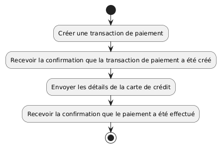
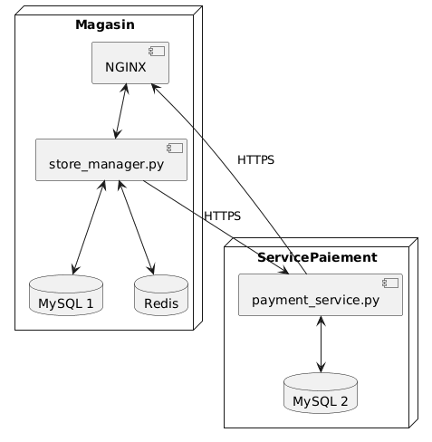

# Payment Service L05 - Documentation d'Architecture
Ce document, basé sur le modèle arc42, décrit un microservice de paiement REST avec Flask pour le Labo 05, LOG430.

## 1. Introduction et Objectifs

### Panorama des exigences
L'application « Payment Service » est un microservice de traitement de paiements simulés pour le système « Store Manager » de gestion de magasin. Il fournit une API REST pour la création, le traitement et la consultation des paiements. Ce service sert de projet éducatif pour démontrer :
- L'implémentation d'une architecture microservices avec Flask
- La séparation des responsabilités de paiement du Store Manager
- Le traitement simulé de paiements par carte de crédit
- La communication inter-services via API REST
- Les principes d'architecture de microservices

### Objectifs qualité
| Priorité | Objectif qualité | Scénario |
|----------|------------------|----------|
| 1 | **Disponibilité** | Le service doit être accessible indépendamment du Store Manager |
| 2 | **Extensibilité** | Ajout facile de nouveaux modes de paiement (crédit, débit, portefeuille électronique), servir d'autres applications en plus de Store Manager |
| 3 | **Maintenabilité** | Séparation claire des responsabilités via les patrons MVC, CQRS et microservices |
| 4 | **Scalabilité** | Le service de paiement peut nécessiter une mise à l'échelle différente des autres modules (par exemple, durant les périodes de forte activité commerciale) |

### Parties prenantes (Stakeholders)
- **Développeuses et développeurs** : Apprendre/enseigner l'architecture microservices et la séparation des responsabilités
- **Application Store Manager** : Service consommateur qui délègue le traitement des paiements

## 2. Contraintes d'architecture

| Contrainte | Description |
|------------|-------------|
| **Technologie** | Utilisation de Python 3, Flask et Docker |
| **Déploiement** | Déploiement en conteneur Docker, API Gateway KrakenD |
| **Éducatif** | L'application doit clairement démontrer les principes microservices et la séparation des responsabilités |
| **Conception API** | Doit suivre les principes RESTful et microservices avec gestion appropriée des erreurs |
| **Simulation** | Le traitement des paiements est simulé (pas de vraie intégration bancaire) |

## 3. Portée et contexte du système

### Contexte métier

Le service de paiements permet :
- La création de transactions de paiement associées à des commandes
- Le traitement simulé de paiements par carte de crédit
- La consultation de l'état et des détails des paiements
- La validation des données de paiement

### Contexte technique
- **Applications clientes** : Application Store Manager, Postman (lors du développement), potentiels autres microservices
- **Couche API** : API REST Flask
- **Couche base de données** : MySQL
- **Communication** : Requêtes HTTP/HTTPS entre clients et serveur API

## 4. Stratégie de solution

| Problème | Approche de solution |
|----------|---------------------|
| **Séparation des responsabilités** | Microservice dédié isolant la logique de paiement du Store Manager |
| **Traitement des paiements** | Simulation de validation de carte de crédit avec états de transaction |

## 5. Vue des blocs de construction

## 6. Vue d'exécution

## 7. Vue de déploiement

## 8. Concepts transversaux
- **Microservices** : Service autonome avec responsabilité unique (traitement des paiements)
- **Principes REST** : Client-serveur, sans état, interface uniforme, utilisation appropriée des codes HTTP
- **Patron MVC** : Séparation entre routes (Vue), contrôleur (Contrôleur) et données (Modèle)

## 9. Décisions d'architecture
Veuillez consulter le fichier `/docs/adr/adr001.md`.

## 10. Exigences qualité

### Disponibilité
- Le service de paiement peux fonctionner même si le Store Manager est indisponible, et vice-versa
- Déploiement conteneurisé pour isolation et résilience

### Extensibilité
- Possibilité d'intégrer des differentes plateformes de paiement comme Stripe, PayPal, portefeuilles électroniques, etc.
- Possibilité d'intégrer avec des autres services, liées au Store Manager ou non

### Maintenabilité
- Séparation claire entre endpoints API, logique métier Store Manager et logique de paiement
- Dépôts independnts permettrent differents équipes de travailler de façon paralélle et faire ses propres choix de technologie et architecture

### Scalabilité
- Le service de paiement peut être déploié en plusiers intances, si il'y a besoin

## 11. Risques et dettes techniques
Non applicable pour cette application.

## 12. Glossaire

| Terme | DéfInition |
|-------|------------|
| **API** | Application Programming Interface |
| **REST** | Representational State Transfer  |
| **Microservice** | Architecture composée de petits services autonomes qui fonctionnent ensemble |
